# Chapter 2: Get your badge to blinky!

| **Project Goal**            | Start programming your Photon, badge, and leverage the device cloud.                        |
| --------------------------- | ------------------------------------------------------------------------------------------- |
| **What you’ll learn**       | How to interact with LEDs; Using Particle variables and cloud functions.                    |
| **Tools you’ll need**       | build.particle.io, console.particle.io, the Particle CLI, a Particle Photon and #PartiBadge |
| **Time needed to complete** | 30 minutes                                                                                  |

In this session, we're going to explore the Particle ecosystem via an interactive, Photon-powered conference badge! If you get stuck at any point during this session, [click here for the completed, working source](https://go.particle.io/shared_apps/5b58e758236934ba580002c7).

## Create a new project in the Web IDE

1.  Navigate to [build.particle.io](http://build.particle.io). You may need to log-in, if prompted.


2.  Once you log-in, you may be directed to the Particle home page. If so, [click here to navigate](https://build.particle.io) back to Particle Build.


3.  When navigating to the Web IDE (Build), the first thing you'll see is an empty editor window for a new project and a prompt to give that project a name.


4.  In the Current App textbox, give your app the name "BlinkyBadge" and hit enter.


5.  Once you've given your project a name, you're ready to code!


## The `setup()` and `loop()` functions

Before we dive into our first bit of code, a brief word about the two functions that were auto-populated into your new app. If you've done Arduino or Particle development before, you're already familiar with these and can skip ahead. If not, read on.

Every Particle application _must_ have two functions in the main file (sometimes called a "sketch"): `setup()` and `loop()`. Both of these functions are called by the Particle Device OS.

True to its name, `setup()` runs only only once when the device starts up and is used for initializing buttons, sensors and other things needed to get your project ready to execute.

`loop()`, on the other hand, runs over and over again as long as your firmware is running on the device. When the function is called by the device OS, the code inside executes sequentially until it reaches the closing brace of the function, before being called again.

While the speed at which the `loop()` function executes is determined by the specific hardware and the time needed to execute the use code you've written in the function, it's important to know that, much of the time, this function will run very fast.

The bulk of your program, from state management, handling user input, reading from sensors and more will take place inside of the `loop()` function. It can take a bit of getting used to if you're not familiar with this style of development, but once you become comfortable, you'll enjoy the power this control provides you as a firmware developer.

## Controlling the Badge LEDs

### Lighting up the Red LED

Now let's blink some badge LEDs! The first thing we need to do is set the [`pinMode`](https://docs.particle.io/reference/firmware/photon/#pinmode-) for our LEDs. On the Photon, every device used in a project, be it a sensor or actuator, is connected to one or more pins on the Photon itself. Sometimes you'll see these referred to as GPIO pins or IO pins, with the "IO" standing for "Input Output." Every pin can either emit a value (via a voltage from the Photon) or receive a value (via a voltage from a source). When initializing your project, you'll want to denote in `setup()` any pins that need to function in one of these modes.

1.  The LEDs on our badge are on pins A0-A4, and all four will be set as `OUTPUT` pins, which we can specify by adding four `pinMode()` calls to the `setup()` function

```cpp
void setup() {
  pinMode(A0, OUTPUT); // Yellow
  pinMode(A1, OUTPUT); // Blue
  pinMode(A2, OUTPUT); // Green
  pinMode(A3, OUTPUT); // Red
}
```

2.  Now that we've configured our LEDs as outputs, let's turn the Red LED on. We'll do this using the [`digitalWrite()`](https://docs.particle.io/reference/firmware/photon/#digitalwrite-) function. `digitalWrite()` takes two parameters: the pin to set, and whether to set the pin to `LOW` (or 0 volts) or `HIGH` (or 3.3v volts, in the case of the Photon). Setting any LED pin to `LOW` cuts off power to the pin, which turns the LED off. Setting it to `HIGH` on the other hand, will turn the LED on. Still inside the `setup()` function, add a single line at the end to turn on our Red LED.

```cpp
digitalWrite(A3, HIGH);
```

3.  To see your first code in action, we need to install the code on a device. This is often referred to as "flashing firmware". In the bottom-left corner of the Web IDE, click on the cross-hairs icon to open the devices panel.


4.  The Devices panel shows a list of all the Particle devices you own, organized by type. Online devices will include a breathing cyan dot next to the name, as well.

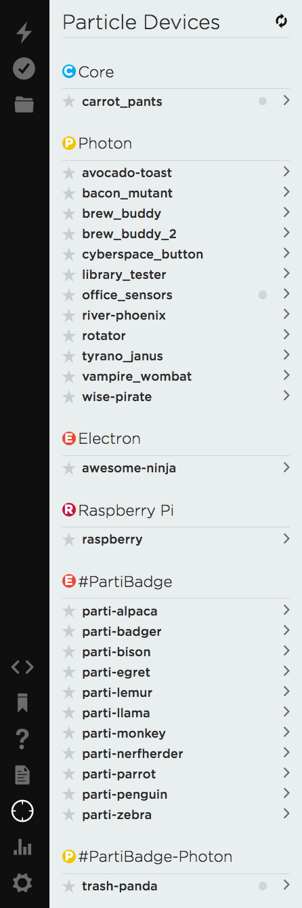

5.  To choose a device to flash, click the start next to the name of the device you want to flash.


6.  Now, click the flash lightning bolt icon in the top-left to flash the firmware to your device.

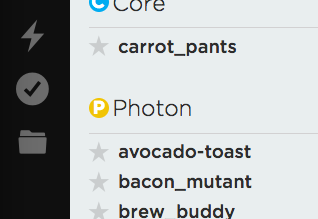

7.  If everything works, you'll see the red LED light up after your Photon comes online.

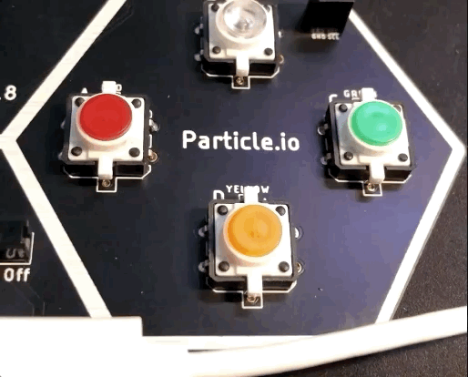

8.  Now, let's change the code a bit to blink the red LED on and off. Remove the `digitalWrite` line from `setup` and add the following to the `loop()` function.

```cpp
void loop() {
  digitalWrite(A3, HIGH);
  delay(1000); // Pause for 1 sec (1,000 ms)
  digitalWrite(A3, LOW);
  delay(1000); // Pause for 1 sec (1,000 ms)
}
```

As stated above, the `loop` function runs very fast. So fast, in fact, that if your loop only contained the two `digitalWrite` statements to toggle the LED on and off, the red LED would shine dimly and never come fully on or turn fully off. One of the ways we can manage this is with the `delay()` function, which accepts a value that represents the number of milliseconds to pause before continuing program execution.

9.  Flash the new firmware to your device and watch that red LED blink!


### Using a Cloud Function to toggle the blue LED

Now that we've mastered using `digitalWrite` to toggle an LED, let's cloud-enable the blue LED!

1.  First, let's create some variables to hold the pin references for our LEDs and the state of the blue LED. Sometimes it can be hard to keep track of what sensors and actuators are assigned to which pins on a device, but we can use variables to help.

```cpp
int yellowLED = A0;
int blueLED = A1;
int greenLED = A2;
int redLED = A3;

bool isBlueOn = false;
```

2.  Once we do this, we'll need to update the `pinMode` and `digitalWrite` calls from the last section. Modify your `setup` and `loop` to look like the following.

```cpp
void setup() {
    pinMode(yellowLED, OUTPUT); // Yellow
    pinMode(blueLED, OUTPUT); // Blue
    pinMode(greenLED, OUTPUT); // Green
    pinMode(redLED, OUTPUT); // Red
}

void loop() {
    digitalWrite(redLED, HIGH);
    delay(1000); // Pause for 1 sec (1,000 ms)
    digitalWrite(redLED, LOW);
    delay(1000); // Pause for 1 sec (1,000 ms)
}
```

3.  Now, we're ready to cloud-ify our blue LED. Start by adding a call to `Particle.function()` in `setup`

```cpp
Particle.function("toggleBlue", toggleBlue);
```

The first parameter in the call above is the name that the Device Cloud API will use to track and execute the function. The name has to be less than 12 characters, so you'll want these to be short, yet descriptive. The second parameter is the name of the firmware function to call when this function is executed from the cloud. These names do not need to match.

4.  Once we've declared the function, we'll need to define the `toggleBlue` handler. Add the following before your `setup()` function:

```cpp
int toggleBlue(String command)
{
  if (isBlueOn)
  {
    digitalWrite(blueLED, LOW);
  }
  else
  {
    digitalWrite(blueLED, HIGH);
  }

  isBlueOn = !isBlueOn;

  return 1;
}
```

`Paticle.function()` Handlers must follow a precise function signature that returns an int and takes a single `String`, which can be used to pass additional information along with the function call. We don't need this parameter at the moment, but we still need to include it in the signature.

In the handler, we're checking the value of the `isBlueOn` variable to determine if the light is on. If it is, we turn it off, otherwise, we turn it on. Then, we set `isBlueOn` to reflect the change and return a `1` to indicate success.

5.  Flash the new firmware to your device. When your photon is breathing cyan again, head over to [console.particle.io](https://console.particle.io) and select your device to view its dashboard.

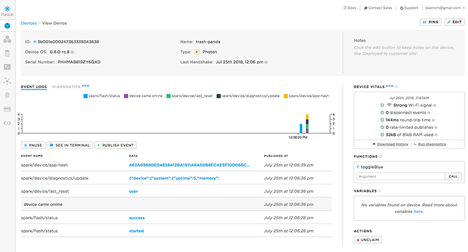

6.  On the right-hand side, you'll see your function under the "Functions" heading.


7.  Click the "Call" button and marvel as your blue LED lights up.

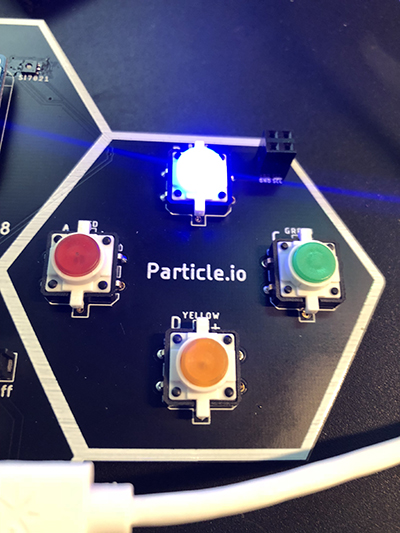

8.  To turn the LED off, click "Call" again.

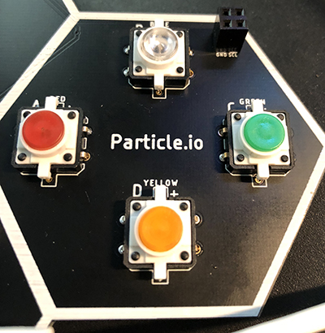

### Using a Cloud Event to toggle the Green LED

Before we move on from LED-blinkery, let's take a look at using Cloud variables and events to toggle the green LED.

1.  First, we'll need a status variable for the green LED. Add the following line under `isBlueOn`:

```cpp
bool isGreenOn = false;
```

2.  Next, declare a cloud variable for the state of the green LED, right after the `Particle.function()` call for the blue LED:

```cpp
Particle.variable("greenOn", isGreenOn);
```

Just as with declaring a function, `Particle.variable()` expects a name (12 character max) for the Device cloud to use to track the variable, and a local variable. Variables must be of type `INT` `DOUBLE`, `STRING`, or `BOOLEAN`.

3.  To check your progress thus far, flash the firmware to your device and head back over to the console. You should see your variable listed underneath the function on your device dashboard.

4.  Click on the "Get" button. Since the value is false, nothing will be returned. We need to add some more code to get it to true.

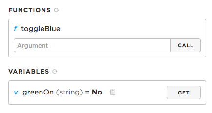

5.  Now we can implement the code to toggle the green LED. Since it will end up looking a lot like the code for toggling the blue LED, lets add a helper function that takes the boolean and the pin of the LED we want to toggle.

```cpp
void toggle(bool isOn, int led) {
  if (isOn)
  {
      digitalWrite(led, LOW);
  }
  else
  {
      digitalWrite(led, HIGH);
  }
}
```

6.  With a helper function in hand, let's add a function to toggle the green LED and refactor our existing `toggleBlue` function.

```cpp
void toggleGreen(const char *event, const char *data)
{
  toggle(isGreenOn, greenLED);

  isGreenOn = !isGreenOn;
}

int toggleBlue(String command)
{
  toggle(isBlueOn, blueLED);

  isBlueOn = !isBlueOn;

  return 1;
}
```

Like `Particle.function()`, `Particle.subscribe()` requires a specific function signature that returns `void` and takes two parameters that contain the `event` name and any `data` passed in the payload.

7.  We have a function to toggle the Green LED, now we need a way to call it! Add the following to the end of your `setup` function:

```cpp
Particle.subscribe("toggleGreen", toggleGreen, MY_DEVICES);
```

8.  Flash the latest firmware to your device and head back to the console. Just under the Event Logs, you should see a button that reads "Publish Event." Click that button and the UI should expand to allow you to enter a name and optional event data. In the "Event name" input, type `toggleGreen`, and leave the "Event data" field blank. Click "Publish" and your badge's green LED should light up.


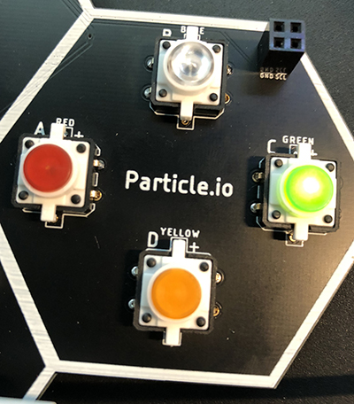

9.  If you click the "Get" button on the "greenOn" variable again, it will now return true.

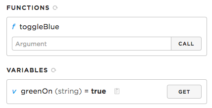

10. Click "Publish" again and the LED will turn off.

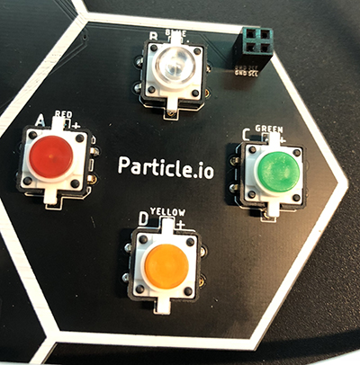

## Writing to the display

Now that you're an LED master, let's write some text to that fancy OLED display on your badge! You'll start by installing a firmware library for the screen and writing some text. Then, you'll set up a cloud function for your name and display it on the screen!

1.  In the Web IDE, look for the libraries icon in the right navigation. It looks like a bookmark.

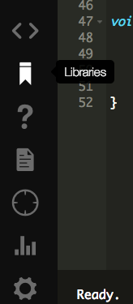

2.  In the slide-out window, you'll see a list of popular official and community libraries, and a search box.

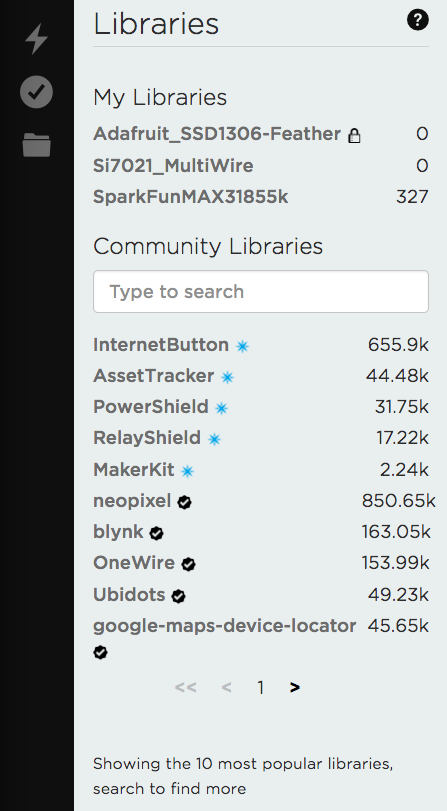

3.  Type "SSD1306" in the search input, which corresponds to the type of OLED screen on your badge.

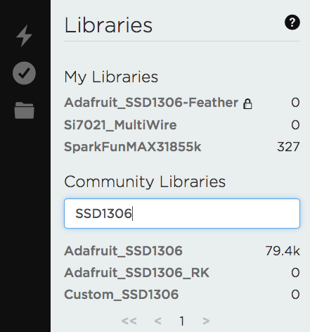

4.  Click on the "Adafruit_SSD1306" entry and you'll navigate to the files for that library, where you can view the source and check out the included examples.

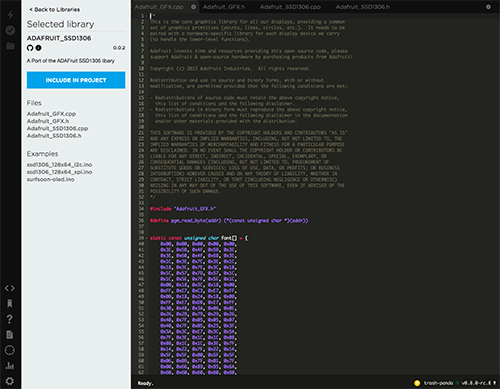

5.  Click "Include in Project" and you'll be asked to choose an app. Select the "BlinkyBadge" app (or the name you chose, if different).

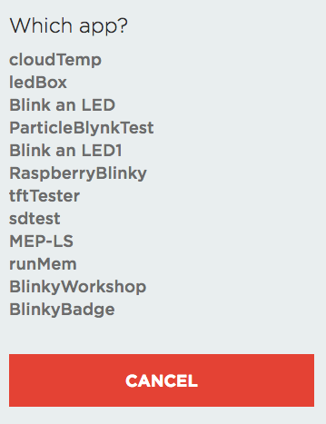

6.  Click "Confirm".

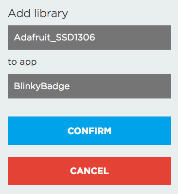

7.  The library will be included in your app, which you'll see in the sidebar. Also notice that an `#include` statement was added for the header file for the library.

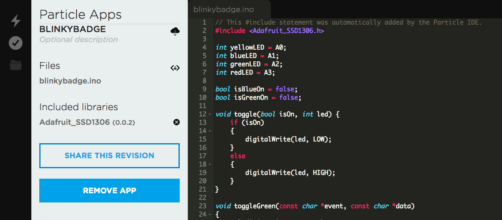

8.  Once we have the library included, we need to add a global variable to our app to reference it. Add the following near the top of your project, outside of the functions.

```cpp
Adafruit_SSD1306 display(RESET);
```

9.  Next, you'll want to initialize the display. Add the following to the beginning of your `setup` function.

```cpp
display.begin(SSD1306_SWITCHCAPVCC, 0x3C);
display.clearDisplay();
display.display();
```

The `begin` call takes a couple of parameters. The first instructs the display to use the 3.3 volt line for power, and the second is the hexadecimal [I2C](https://en.wikipedia.org/wiki/I%C2%B2C) address of the display. We'll talk more about I2C in the next session.

After initializing the display, we'll clear it.

10. The Adafruit library for this display provides a number of convenience functions that make it simple to write text and even manipulate pixels to draw images or animations. Let's start by writing our name on the display. Add the following to the bottom of the `setup` function:

```cpp
display.clearDisplay();
display.setTextWrap(true);
display.setTextColor(WHITE);
display.setTextSize(3);
display.setCursor(0, 0);
display.println("Brandon Satrom"); //Replace with your name.
display.display(); // Flush everything to the screen
```

The first thing to do is clear the display. Then, calling the `setTextWrap` function will let the display know that it should wrap text to the next line, instead of cutting it off. We'll set the size, position the cursor at the top left of the display and then call `println` to display a name on the screen. Finally, calling `display()` flushes all pending changes to the screen.

11. Now, when you flash the firmware to your device, you'll see your name pop up on the screen. Or mine, if you didn't change the default.

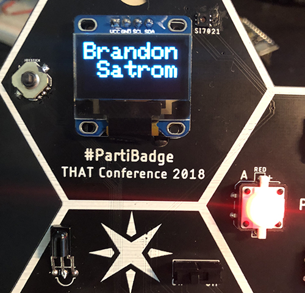

12. That's pretty cool, but what if we don't want to hard code our names to our badges? We can use a cloud function to set a name and display it to the screen! First, let's create a new `Particle.function()`.

```cpp
Particle.function("displayName", displayName);
```

13. And for the `displayName` function, move the code you added to `setup` for displaying your name.

```cpp
int displayName(String command)
{
  display.clearDisplay();
  display.setTextWrap(true);
  display.setTextColor(WHITE);
  display.setTextSize(3);
  display.setCursor(0, 0);
  display.println(command);
  display.display();

  return 1;
}
```

This time, we'll write whatever is passed into the `displayName` function to the screen.

14. Flash the latest firmware and head back to your device in the console. You should see a `displayName` function.

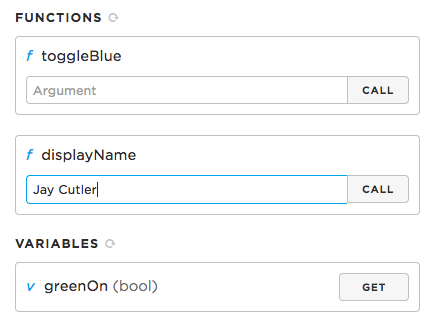

15. Enter a value and hit the "Call" button to see your name displayed on the screen.

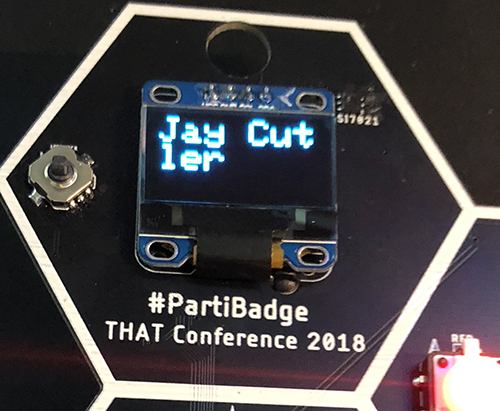

### BONUS: Command your badge from the Particle mobile app!

So far, we've used the Console to interact with Particle functions and variables, but you can do the same with the Particle iOS and Android apps!

1.  Open your mobile app and login.

2.  In the device list, select the device powering your badge.

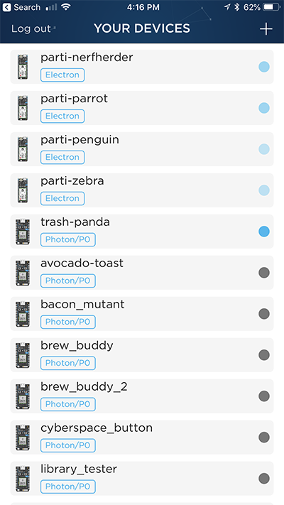

3.  On the device inspector screen, click on the "Data" tab.

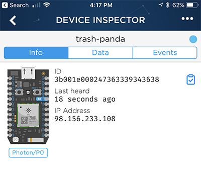

4.  From here, you can inspect variables and call functions, just like you can from the console. Try updating your name and toggling the blue LED from here, as well!

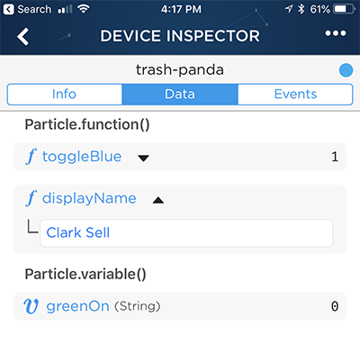

You're getting to be a Particle pro now! Let's level up and explore more of the features of your badge and the Particle ecosystem.
