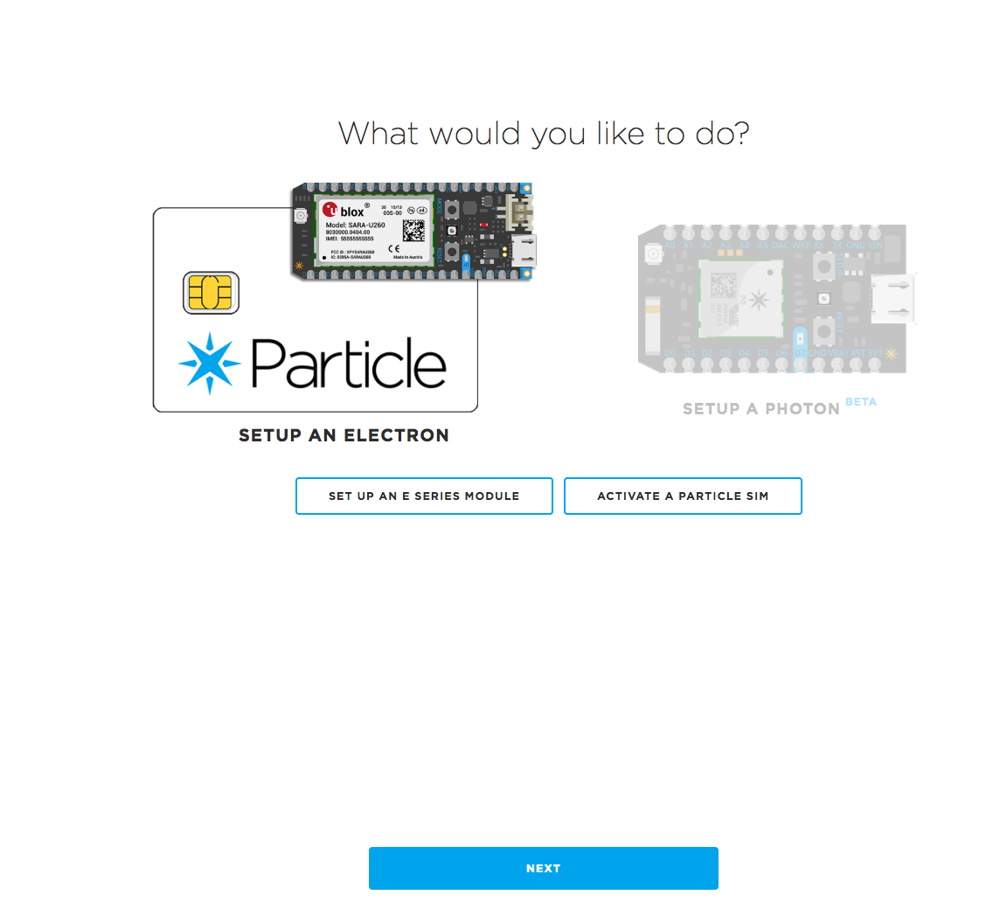
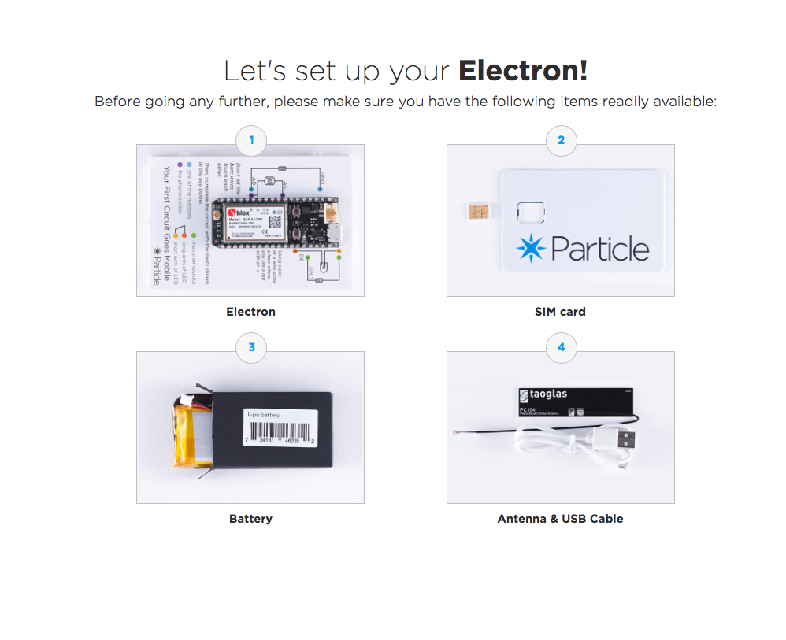
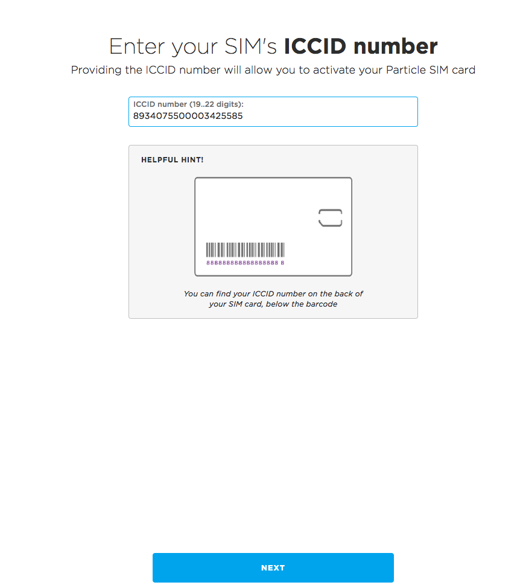
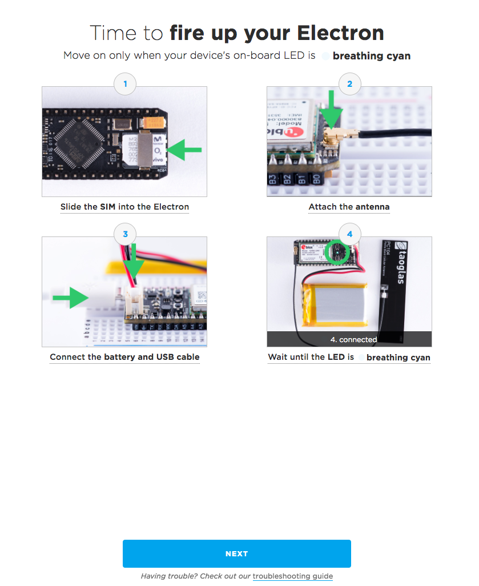
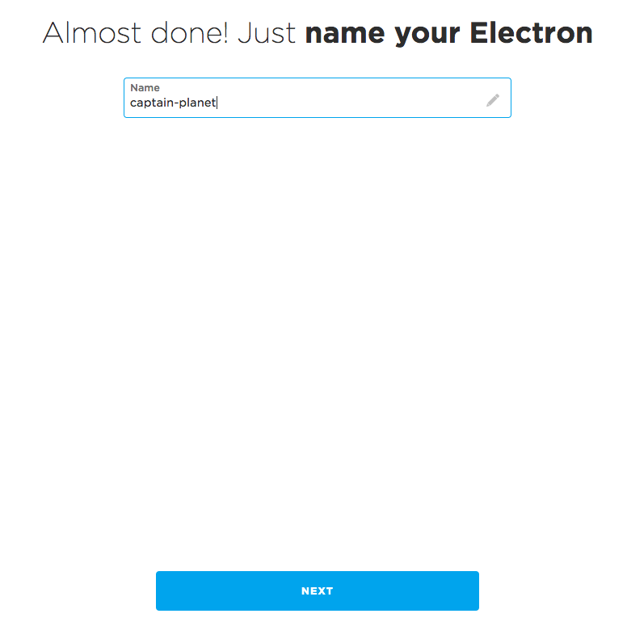

# Chapter 1: Claiming Your Particle Electron

| **Project Goal**            | Get your Particle Electron online and claimed to your account                     |
| --------------------------- | --------------------------------------------------------------------------------- |
| **What you’ll learn**       | How to claim a new Particle Electron using a browser and the Particle mobile app. |
| **Tools you’ll need**       | A Electron, USB Cable, the Particle mobile app for iOS or Android.                |
| **Time needed to complete** | 15 minutes                                                                        |

## 2 Ways to Claim A New Device

Particle provides two methods for claiming a new Electron:

1.  [The Particle Mobile App](#mobile-app-instructions)
2.  [A Web browser](#browser-instructions)

For this workshop, we'll use the web browser, but both methods are provided for your information.

Once you've claimed your Electron, you'll use [Tinker](https://docs.particle.io/guide/getting-started/tinker/Electron/) on the Particle mobile app to interact with your new device.

## Before you start

1.  Create a new [Particle account](https://login.particle.io/signup)
2.  Install the Particle [iOS](https://itunes.apple.com/us/app/particle-build-Electron-electron/id991459054?ls=1&mt=8) or [Android](https://play.google.com/store/apps/details?id=io.particle.android.app) App
3.  [Install the Particle CLI](https://docs.particle.io/guide/getting-started/connect/Electron/#install-the-particle-cli)
4.  [Install the Particle Desktop IDE](https://docs.particle.io/guide/tools-and-features/dev/)

## Browser Instructions

1.  Navigate to [setup.particle.io](https://setup.particle.io/) in your browser

2.  Choose "Setup an Electron" and click Next.

3.  Make sure you have your Electron on hand as well as the antenna, usb cable and SIM card.

4. Enter the ICCID number printed on the SIM card included with your Electron.

5. Insert the SIM into the bottom of the electron and attach the antenna. Then, connect the battery and USB cable.

6. Once the onboard LED is breathing cyan, click next.

9.  Pick a name. You can use the suggested name, or choose your own.

10. Once you click next, your Electron is ready for use, and you can play with it via Tinker [using the instructions below](#interacting-with-your-Electron-with-tinker)!

## Mobile App Instructions

**Note**: Images below are from the iOS setup. The flow of the Android setup experience is similar.

1.  Open the Particle Mobile App.

2.  Login, or create a new account if you don't already have one.

3.  On the "Your Devices" screen, click the "+" in the top-right to add a new device.

4.  Select the "Electron" option.

5.  Click "Setup an Electron," then Next.

6.  Make sure you have your Electron on hand as well as the antenna, usb cable and SIM card.

7. Enter the ICCID number printed on the SIM card included with your Electron.

8. You can also scan the ICCID using your phone camera.

9. Insert the SIM into the bottom of the electron and attach the antenna. Then, connect the battery and USB cable.

10. The app will connect the Particle Device Cloud, find your Electron and claim it to your account.

11. Finally, you'll be prompted to name your device. You can use the suggested name, or choose your own.

12. Once you click done, your Electron is ready for use, and you can play with it via Tinker [using the instructions below](#interacting-with-your-Electron-with-tinker)!

## Interacting with your Electron with Tinker

Now that you've claimed your Electron, let's light up an LED!

**Note**: images below are from the iOS Particle app. The flow of the Android experience is similar.

1.  Open the Particle Mobile App.

2.  Your new device should show up in the list with the name you gave it. If the Tinker firmware is still on the device, you'll see that indicated as well. If Tinker is not still on the device, you can flash it back onto the device using the Particle CLI with the command `particle flash <deviceName> tinker`.

Tap the device you want to interact with via Tinker.

3.  When you select a device flashed with the Tinker firmware, you'll see a list of some of the GPIO pins on the Electron, eight on each side, or 16 in total. With Tinker, you can control the digital and analog pins via reads and writes. If you have sensors or actuators connected to the Electron, you can control them with Tinker.

4.  Every Electron has a blue LED that's connected to pin D7, and we can use Tinker to control this LED. Tap on the circle marked "D7" and you'll see a pop-up that gives you two options, `digitalRead` and `digitalWrite`. We'll learn more about what these mean in the next lab. For now, click on `digitalWrite`.

5.  Once you select `digitalWrite` the pin button will be highlighted in red and show its current value. At first, this value will be digital `LOW` (or 0).

6.  Tap the button. You'll notice that it changed to `HIGH` (or 1).

7.  When the value changes to high, you'll also notice that the blue light at D7 is on! Behind the scenes, Tinker is calling the `digitalWrite` and passing in either a `LOW` or `HIGH` value, which turns the LED off or on. Press the button again and you'll note that the LED turns back off.

Congratulations! You've claimed and named your first Electron, and made it light up using the Tinker app. Now it's time to start building a real app that connects to sensors and controls actuators!
