# Chapter 1: Claiming Your Particle Device

| **Project Goal**            | Get your Particle Photon online and claimed to your account                    |
| --------------------------- | ------------------------------------------------------------------------------ |
| **What you’ll learn**       | How to claim a new Particle device using a mobile app, web browser or the CLI. |
| **Tools you’ll need**       | A Photon, USB Cable, the Particle CLI                                          |
| **Time needed to complete** | 15 minutes                                                                     |

## 3 Ways to Claim A New Device

Particle provides three methods for claiming a new Photon:

1.  [The Particle Mobile App](#mobile-app-instructions)
2.  [A Web browser](#browser-instructions)
3.  [The Particle CLI](#particle-cli-instructions)

Approaches #1 and #2 use SoftAP capabilities on the Photon to cause the device to appear as a Wi-Fi access point. Once connected, you can configure the device's connection to a local Wi-Fi network. Approach #3 is more common for power users or in workshop settings where a large number of devices are being claimed simultaneously.

Once you've claimed your Photon, you'll use [Tinker](https://docs.particle.io/guide/getting-started/tinker/photon/) on the Particle mobile app to interact with your new device.

## Before you start

1.  Create a new [Particle account](https://login.particle.io/signup)
2.  Install the Particle [iOS](https://itunes.apple.com/us/app/particle-build-photon-electron/id991459054?ls=1&mt=8) or [Android](https://play.google.com/store/apps/details?id=io.particle.android.app) App
3.  [Install the Particle CLI](https://docs.particle.io/guide/getting-started/connect/photon/#install-the-particle-cli)
4.  [Install the Particle Desktop IDE](https://docs.particle.io/guide/tools-and-features/dev/)

## Mobile App Instructions

**Note**: Images below are from the iOS setup. The flow of the Android setup experience is similar.

1.  Open the Particle Mobile App.

2.  Login, or create a new account if you don't already have one.

3.  On the "Your Devices" screen, click the "+" in the top-right to add a new device.

4.  Select the "Photon" option.

5.  Plug your device into power using a USB cable. You can connect to a computer, though this is not required when using the mobile app.

6.  The next screen will instruct you to go to your phone's Settings and to look for a Wi-Fi access point named "Photon-" and a string of characters unique to the device.

7.  **Note**: The app will suggest that this string is 4 characters long. For newer Photons, this string will be six characters long. For instance, the Photon below broadcasts "Photon-UQGKCR." This string corresponds to the last six characters of the UPC code printed on the box for your device.

Once you've selected the Photon access point, you'll see a notification that you can return to the Particle app to continue setup.

8.  The app will then connect to the Photon, scan for Wi-Fi networks and prompt you to select a network.

9.  Then, you'll be prompted for the network password.

10. The app will then configure Wi-Fi on the device, reset it, wait for a Device Cloud connection and verify your ownership of the device.

11. Finally, you'll be prompted to name your device. You can use the suggested name, or choose your own. Once you click done, your Photon is ready for use, and you can play with it via Tinker [using the instructions below](#interacting-with-your-photon-with-tinker)!

## Particle CLI Instructions

1.  Plug your Photon into a serial port on your computer.

2.  Make sure your device is in "Listening Mode" (aka blinking blue). If the Photon is not in listening mode, hold down the `SETUP` button for three seconds, until the RGB LED begins blinking blue.

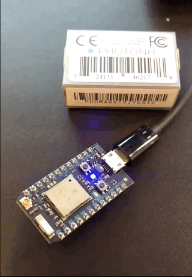

3.  Run `particle login` to login with your account.

4.  Run `particle setup` and follow the on-screen prompts. The CLI should automatically detect your USB connected Photon. If it doesn't, make sure that the device is blinking blue, indicating that it is in listening mode.

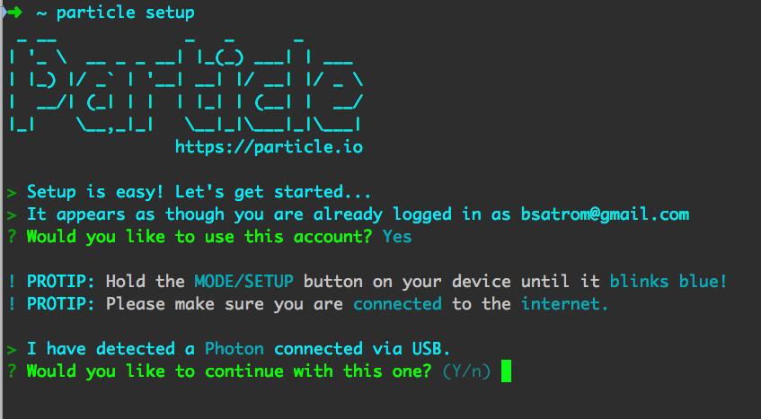

5.  The CLI will scan for nearby Wi-Fi networks and present you with a list to choose from. Select the network as identified by your instructor.

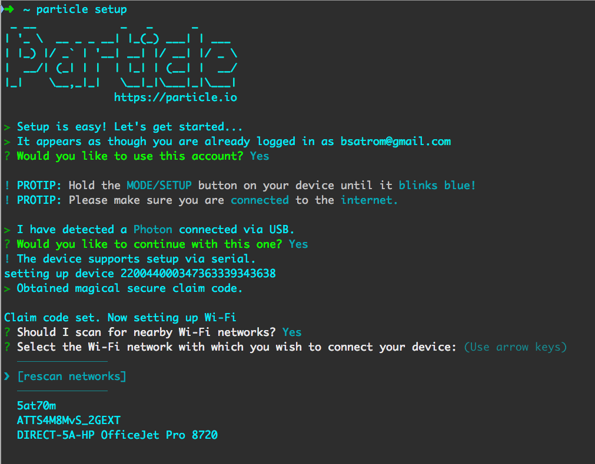

6.  Follow the prompts to auto-detect the security type for your network, then enter the password. This should have been provided by your workshop instructor.

7.  Once you've entered the network password, your device will reset and start "breathing cyan," indicating that it has successfully connected to the Particle Device Cloud.

8.  Now it's time to name your new Photon. Pick something fun and memorable!

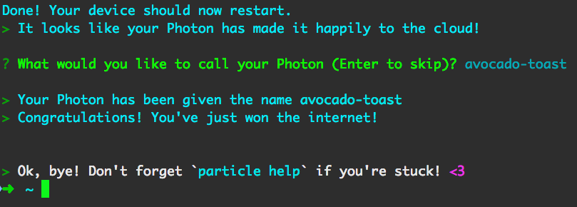

If you're online, [skip below](#interacting-with-your-photon-with-tinker) to play with your new Photon with Tinker. For reference, we've provided the setup instructions for the web and mobile approaches, below.

## Browser Instructions

1.  Navigate to [setup.particle.io](https://setup.particle.io/) in your browser

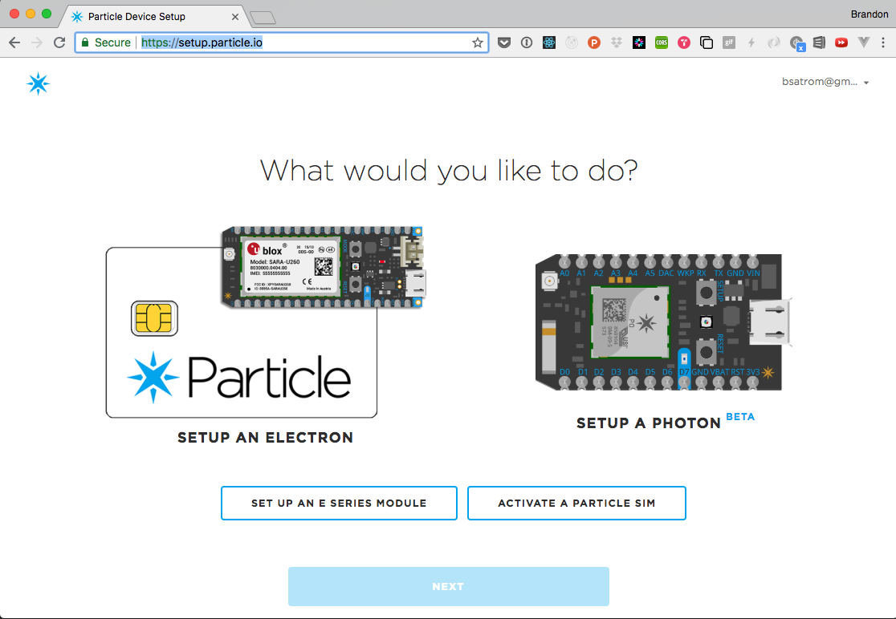

2.  Choose "Setup a Photon" and select Next

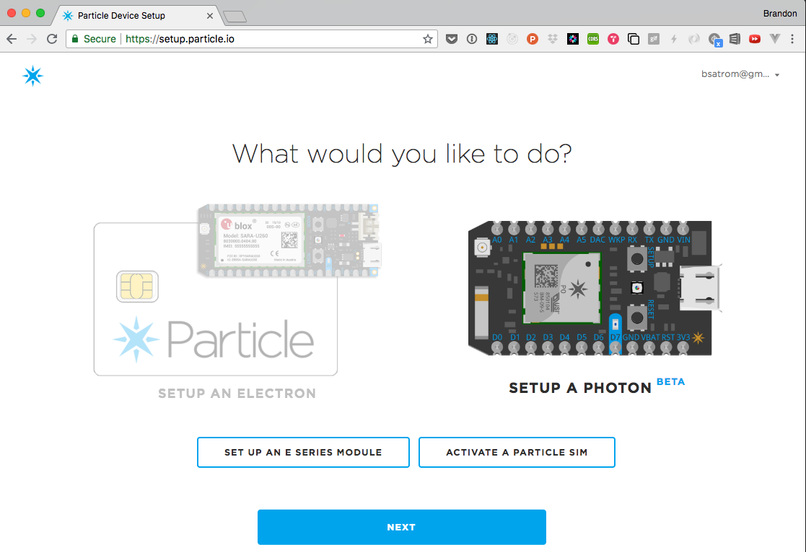

3.  Make sure you have your Photon on hand and a USB power cable available

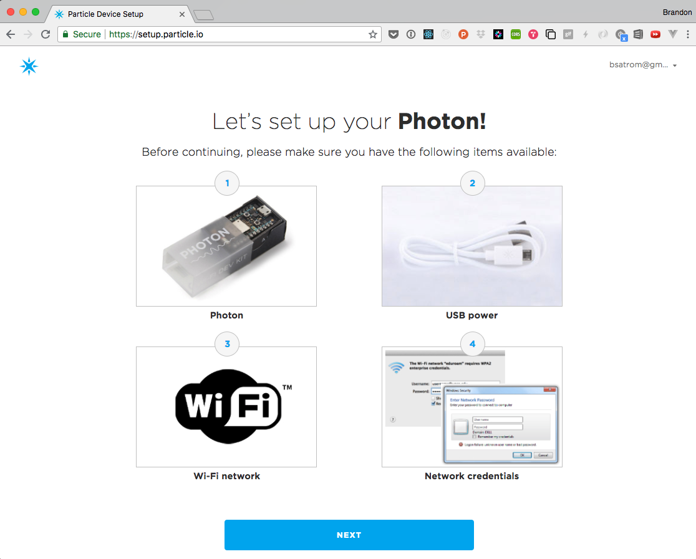

4.  Download the Photon Setup File to your computer

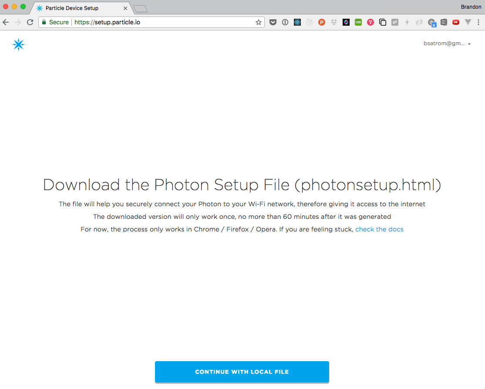

5.  Open "photonsetup.html"

6.  Find your device in the Wi-Fi List and Connect to it. Look for a Wi-Fi access point named "Photon-" and a string of characters unique to the device (Note: the app will suggest that this string is 4 characters long. For newer Photons, this string will be six characters long. For instance, the Photon below broadcasts "Photon-CKDH2Z." This string corresponds to the last six characters of the UPC code printed on the box for your device.)

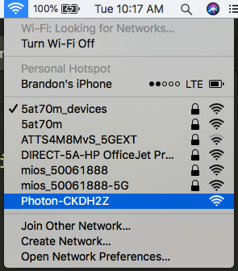

7.  The browser will automatically detect when you've connected to your Photon and prompt you to choose a network SSID and enter the password.

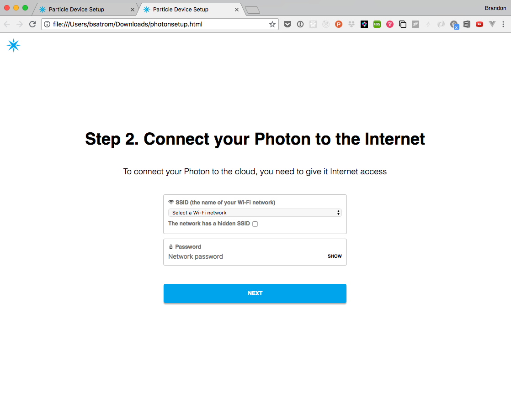

8.  Reconnect to your network so that the device's connection can be verified. If everything works, you'll be instructed to name your device.

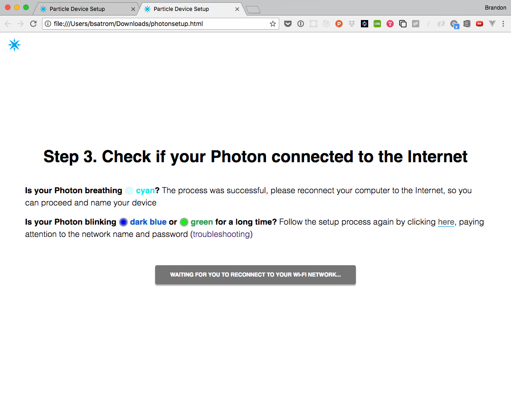

9.  Pick a name. You can use the suggested name, or choose your own.

10. Once you click done, your Photon is ready for use, and you can play with it via Tinker [using the instructions below](#interacting-with-your-photon-with-tinker)!

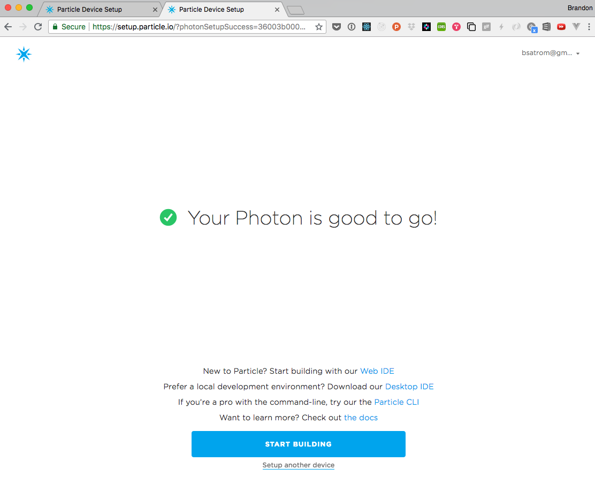

## Interacting with your Photon with Tinker

Now that you've claimed your Photon, let's light up an LED!

**Note**: images below are from the iOS setup. The flow of the Android setup experience is similar.

1.  Open the Particle Mobile App.

2.  Your new device should show up in the list with the name you gave it. If the Tinker firmware is still on the device, you'll see that indicated as well. If Tinker is not still on the device, you can flash it back onto the device using the Particle CLI with the command `particle flash <deviceName> tinker`.

Tap the device you want to interact with via Tinker.

3.  When you select a device flashed with the Tinker firmware, you'll see a list of all the GPIO pins on the Photon, eight on each side, or 16 in total. With Tinker, you can control the digital and analog pins via reads and writes. If you have sensors or actuators connected to the Photon, you can control them with Tinker.

4.  Every Photon has a blue LED that's connected to pin D7, and we can use Tinker to control this LED. Tap on the circle marked "D7" and you'll see a pop-up that gives you two options, `digitalRead` and `digitalWrite`. We'll learn more about what these mean in the next lab. For now, click on `digitalWrite`.

5.  Once you select `digitalWrite` the pin button will be highlighted in red and show its current value. At first, this value will be digital `LOW` (or 0).

6.  Tap the button. You'll notice that it changed to `HIGH` (or 1).

7.  When the value changes to high, you'll also notice that the blue light at D7 is on! Behind the scenes, Tinker is calling the `digitalWrite` and passing in either a `LOW` or `HIGH` value, which turns the LED off or on. Press the button again and you'll note that the LED turns back off.

Congratulations! You've claimed and named your first Photon, and made it light up using the Tinker app. Now it's time to start building a real app that connects to sensors and controls actuators!
